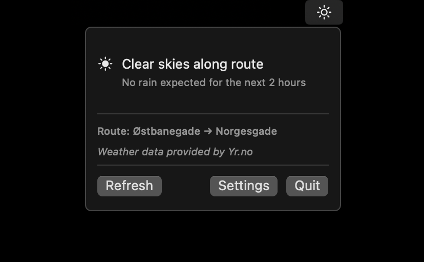
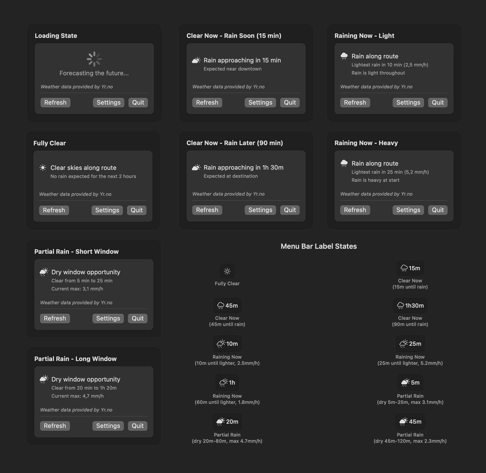

# RainCheck ☔

A macOS menu bar app that provides rain forecasts for cycling routes and daily commutes.



---

RainCheck is a macOS menu bar application designed specifically for cyclists and commuters who need to know when and where rain will affect their routes.

Unlike traditional weather apps that show general forecasts for a single location, RainCheck analyzes weather conditions along an entire journey to provide precise information on when to ride.

## Features

RainCheck provides four distinct advisory states:

- **Fully Clear**: No rain expected along your route
- **Clear Now**: Currently dry, but rain is coming - shows when and where
- **Raining Now**: Currently raining - provides timing for when conditions will improve
- **Partial Rain**: Mixed conditions with dry windows - identifies the best time to travel
- **Route-specific locations**: Tells you if rain will be "near start", "mid-route", or "near destination"
- **Intensity tracking**: Shows rain intensity levels to help you decide if it's rideable
- **Custom start and end locations**: Set your daily commute route



## Installation

### Requirements

- macOS 13.0 or later
- Swift 6 or later (for building from source)

### Releases

1. Download [the latest release](https://github.com/andersfischernielsen/RainCheck/releases)
2. Unzip the app
3. Open the app
   - If needed, grant permission to run the app in _System Settings_ > _Privacy & Security_

### Building from Source

1. Clone the repository:

   ```bash
   git clone https://github.com/yourusername/RainCheck.git
   cd RainCheck
   ```

2. Build the application:

   ```bash
   swift build -c release
   ```

3. Run the application:
   ```bash
   swift run
   ```

## Implementation

1. **Route Analysis**: Points are calculated along a given route (every ~200-500 meters)
2. **Multi-Source Weather**: Precipitation forecasts are fetched from both Yr.no and Apple WeatherKit APIs
3. **Route Sampling**: Weather data is combined to find the worst conditions along the route
4. **Actionable Advice**: Clear time-based recommendations are shown in the menu bar

### Weather Data Sources

RainCheck uses a dual-source approach for maximum accuracy:

- [Yr.no](https://yr.no) (Norwegian Meteorological Institute) - 70% weight
- Apple WeatherKit - 30% weight

## Usage

### First Time Setup

1. Launch RainCheck and click the RainCheck icon in the menu bar
2. Click _Settings_ to configure your route
3. Enter your starting location and destination
4. Save settings and monitor the menu bar icon

#### Reading the Menu Bar

The menu bar icon changes based on current conditions:

- **☀️ Sun**: Clear weather ahead
- **🌧️ Cloud with rain**: Rain is coming
- **⛅ Cloud with sun and rain**: Currently raining with improving conditions
- **🌧️ Filled rain cloud**: Heavy rain or prolonged wet conditions

The text next to the icon shows timing:

- `15m` = Rain starts/stops in 15 minutes
- `1h30m` = Rain starts/stops in 1 hour and 30 minutes

## Data Sources

RainCheck uses a dual-source weather approach for enhanced accuracy:

### Primary Data Source

- **[Yr.no](https://yr.no)**: Free weather service from the Norwegian Meteorological Institute
- **Weight**: 70% in combined forecasts
- **Coverage**: Global, high-quality European data

### Secondary Data Source

- **Apple WeatherKit**: Apple's weather service
- **Weight**: 30% in combined forecasts
- **Fallback**: Automatic fallback to Yr.no only if WeatherKit unavailable
- **Note**: Requires proper app entitlements for full functionality

The weighted combination of both sources provides more reliable precipitation forecasts than relying on a single source.

## Privacy

- Location data is only used for weather API requests
- No personal data is stored or transmitted
- All weather requests are made directly to Yr.no
- No analytics or tracking

## Acknowledgments

- Weather data provided by [Yr.no](https://yr.no) (Norwegian Meteorological Institute)
- Built with Swift and SwiftUI
- Icons from SF Symbols

---

Stay dry! 🚴‍♀️ ☔
